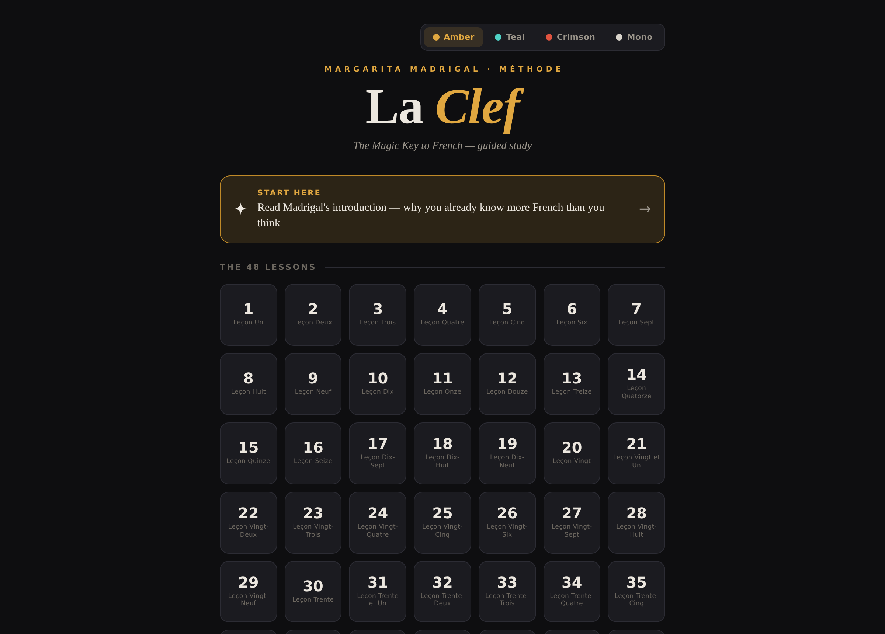
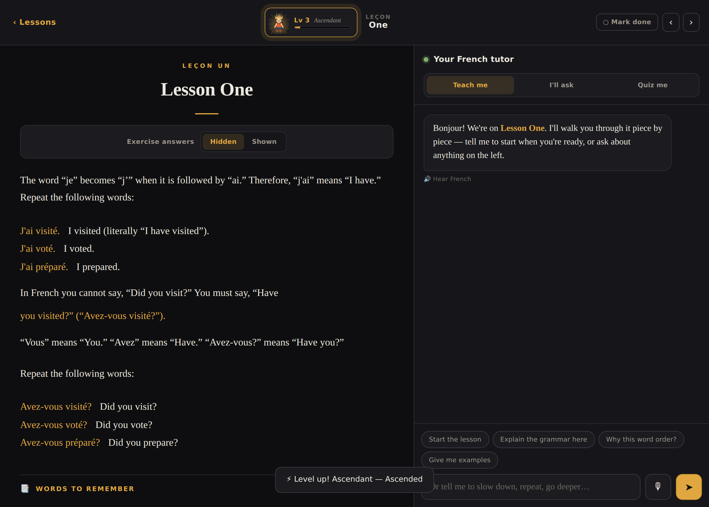
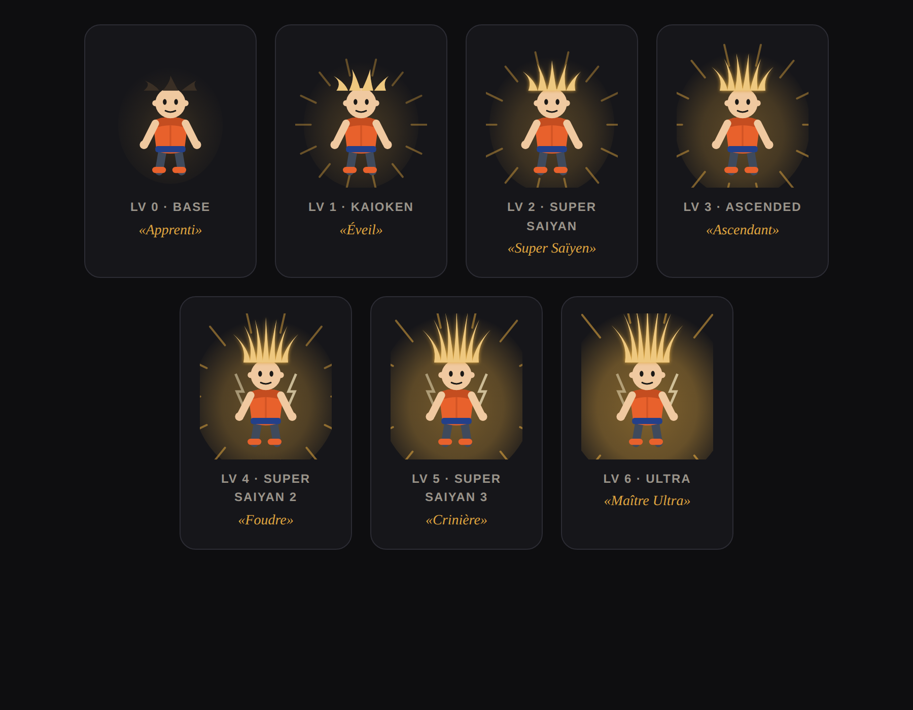
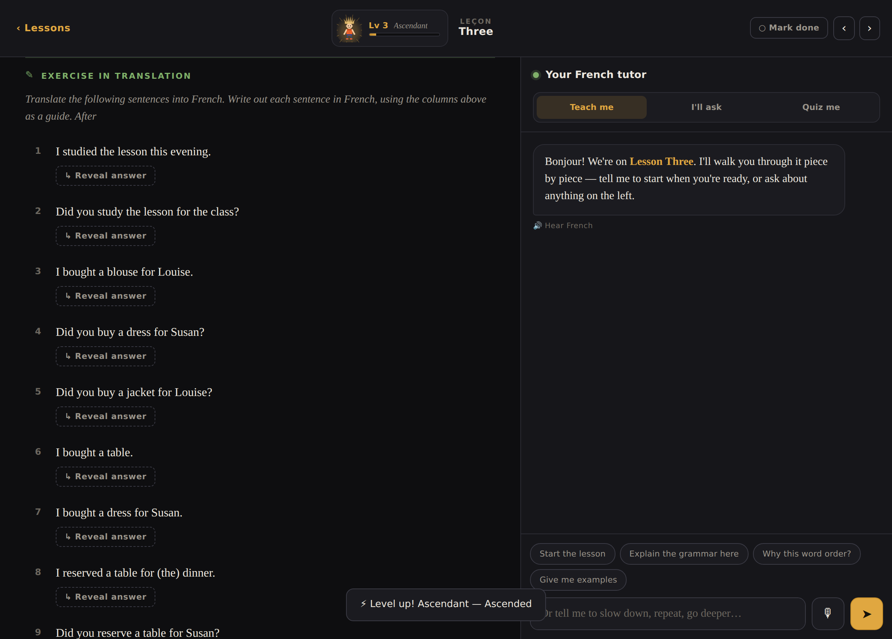
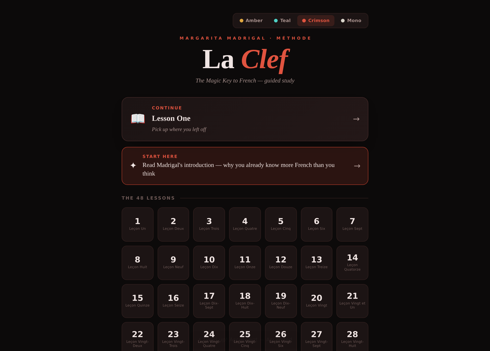

# La Clef — a guided way to learn French from a classic 1959 book

**La Clef** ("the key") turns Margarita Madrigal's 1959 primer *Madrigal's Magic Key to French* into a single, self-contained web app you can actually study from. The book's whole idea is that English speakers already recognize thousands of French words — so you learn to *build* French instead of memorizing it. This app keeps that method and adds a clean reader, self-test exercises, voice, an optional AI tutor, and a little fighter who powers up as you work through the book.

It's one HTML file. No install, no build step, no accounts. Open it and start.

---

## What it does

- **Reads the whole book** — the preface plus all 48 lessons, formatted for the screen. French is color-coded, English glosses are dimmed, vocabulary tables and conversations are laid out cleanly.
- **Self-test exercises** — translation exercises hide the French answers by default. Reveal them one at a time to check yourself, or flip a switch to show them all.
- **Sentence-builder exercises** — the book's mix-and-match column drills are shown as tappable word chips so you can see the pieces you're meant to combine.
- **Hear it and say it** — the tutor can read French aloud, and you can answer out loud with your microphone (browser speech, no setup).
- **An AI tutor** (optional) — sits beside each lesson and can teach you step by step, answer your questions, or quiz you. It reads the on-screen lesson so it always knows where you are. *(Needs an AI backend connected — see "The tutor" below.)*
- **A fighter who levels up** — a little French "super saiyan" who gains XP and transforms as you progress. More on him below.
- **Four dark themes** — Amber, Teal, Crimson, Mono. Everything (including the fighter) recolors to match.
- **Remembers your progress** — current lesson, completed chapters, XP, and theme are saved between sessions.

---

## The fighter

You study with a companion in the top bar — a small fighter who starts as a calm "Apprenti" and transforms as you earn XP, all the way up to a maxed-out "Maître Ultra." His hair grows, his aura intensifies, energy rays and lightning appear, and he recolors to your theme.

**He earns XP four ways:**

| Action | XP |
| --- | --- |
| Finish a chapter | 100 |
| Get a tutor quiz question right | 8 |
| Reveal/check an exercise answer | 3 |
| Daily study streak | +5% bonus per day (up to +50%) |

The leveling is deliberately paced so progress feels *earned*. Finishing all 48 chapters gets you most of the way; reaching the final form takes the whole book plus real practice. Tap the fighter any time to see your level, XP, streak, and what's next.

---

## How it was built

This wasn't a copy-paste job — the source was a scanned 1959 book, so most of the work was getting clean, structured text out of it and then making that text render well.

1. **OCR** — the scanned page images were run through Tesseract with the French language pack (essential, or every accent is lost). The result is ~135,000 words of raw text (`data/ocr-full-text.txt`).
2. **Segmentation** — split into the preface + 48 lessons, working around the table of contents and tricky matches like "THIRTY" inside "THIRTY-SEVEN."
3. **Cleaning** — repaired ~230 hyphenation breaks the scan split across lines, stripped page headers and stray page numbers, and fixed recurring OCR misreads (for example "Nore:" → "Note:"). See `scripts/process_lessons.py`.
4. **Formatting** — the app figures out, line by line, what's French vs. English, splits the two-column vocabulary tables the scan merged together, builds the exercise hide/reveal, and lays out the sentence-builder chips. This all happens in the browser.

The cleaned lesson data lives in `data/lessons.json`.

---

## The tutor

The live tutor is the one part that needs a "brain" behind it — an AI model to generate its replies. The app is written so that brain is a **swappable component**, and there are free options:

- **Run a model locally** with [Ollama](https://ollama.com) on your own machine — free, private, works offline. Point the app at `http://localhost:11434`. Great for the beginner-level content in this book.
- **Use a free API tier** from a provider like Google Gemini or Groq — paste in your own key.
- **Skip the tutor entirely** — the reader, exercises, voice, themes, and the fighter all work without it.

Everything except the live tutor and the quiz-XP it awards works with zero setup.

---

## Try it

Open `app/la-clef.html` in any modern browser. That's it.

- **Reading, exercises, voice, themes, the fighter:** work immediately, fully offline.
- **The live tutor:** connect an AI backend first (see "The tutor" above).
- **Saving progress across sessions:** works when the app is served from a host that provides browser storage; as a plain local file it saves for the current session.

## Install it on your phone

La Clef is a **Progressive Web App** — you can install it on Android or iPhone straight from the browser, no app store needed. Once installed it gets its own icon, opens fullscreen, and works offline.

1. Host it (the free [GitHub Pages](docs/PUSH-TO-GITHUB.md) option works) so you have an `https://` link.
2. Open that link in your phone's browser.
3. **Android (Chrome):** tap the menu → **Add to Home screen** (or accept the install prompt).
   **iPhone (Safari):** tap Share → **Add to Home Screen**.

See [`docs/INSTALL-ON-PHONE.md`](docs/INSTALL-ON-PHONE.md) for the full guide, including the path to a real Android APK if you want one later.

---

## What's next

See [`docs/ROADMAP.md`](docs/ROADMAP.md). The headline: **Madrigal's Magic Key to Spanish** is the planned next edition — same engine, same fighter, a different book.

---

## A note on the source text

The lessons come from *Madrigal's Magic Key to French* by Margarita Madrigal (with Colette Dulac), Doubleday, 1959. That **content belongs to its original author and publisher** — it is not mine, and the license below covers only the code I wrote (the app, the data pipeline, the fighter), not the book's text. This project is a personal learning tool and a portfolio piece. If you want the lessons, please support the original work.

## License

The **code** in this repository is released under the MIT License — see [`LICENSE`](LICENSE). This applies to the app, scripts, and prototypes only, not to the lesson content described above.
